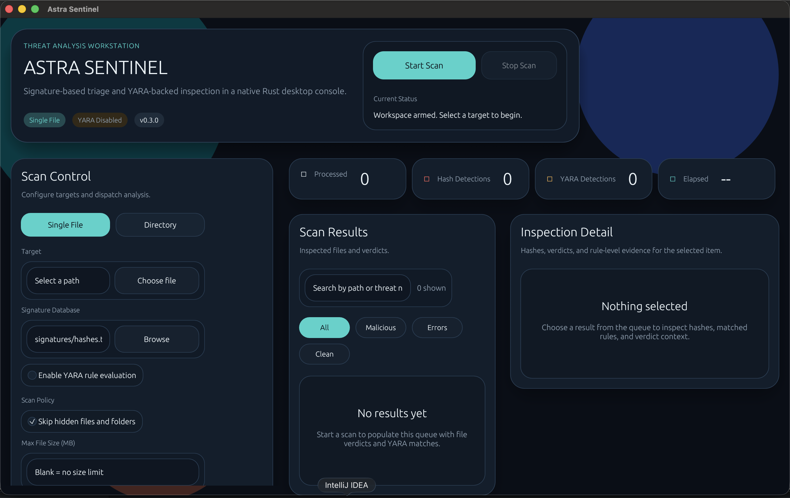

# Astra Sentinel

`Astra Sentinel` is a Rust desktop malware triage app for fast local file inspection with:

- Known-bad hash matching
- Optional YARA rule execution
- Recursive directory scanning
- Result filtering and search for large scans
- JSON report export
- Operator-controlled scan stop/cancellation
- Curated threat-feed sync for YARA rules
- Local signature database management from the desktop UI

The project started as a Go CLI and is now a native Rust desktop application built for a cleaner operator workflow.

## Screenshot



## Positioning

`Astra Sentinel` is a local analysis workstation, not a background antivirus daemon. It is meant for:

- Manual file triage
- Rule-based malware research
- Small-scale sample inspection
- Educational visibility into how signature and YARA detection work

## Core Features

- Native desktop UI built with `eframe` and `egui`
- MD5, SHA1, and SHA256 hashing in one scan pass
- Signature lookup against `signatures/hashes.txt`
- Optional YARA scanning through the system `yara` binary
- Recursive folder scanning with streamed per-file verdicts
- Stop-scan support for long-running jobs
- Result filtering and search for large file sets
- JSON report export for offline review or handoff
- Scan policy controls for hidden paths and file size limits
- Curated threat-feed sync from central public YARA repositories
- In-app signature insertion for known-bad hashes

## Detection Model

### Hash signatures

Each scanned file is hashed with:

- `MD5`
- `SHA1`
- `SHA256`

Those values are checked against the local signature database.

### YARA

When enabled, `Astra Sentinel` executes the installed `yara` binary against every `.yar` or `.yara` rule file in the chosen rules path.

The app reports:

- Matched rule name
- Namespace derived from the rule filename
- Tags when present
- Matched strings and offsets

## Threat Feeds

`Astra Sentinel` now supports curated YARA feed sync into `feeds/rules/`.

The product-oriented approach is:

- Sync trusted public YARA repositories
- Stage them in a managed local feed directory
- Use the synced feed directory as the scanner's YARA rules path

Current curated sources:

- [Yara-Rules](https://github.com/Yara-Rules/rules)
- [Neo23x0/signature-base](https://github.com/Neo23x0/signature-base)

This is intentionally safer than blindly appending bulk public hash feeds into the local signature database, which often increases noise and false positives faster than it improves detection quality.

## Requirements

- Rust toolchain
- `yara` installed if you want YARA scanning

### Install YARA

macOS:

```bash
brew install yara
```

Ubuntu/Debian:

```bash
sudo apt install yara
```

Windows:

Use the official [YARA releases](https://github.com/VirusTotal/yara/releases).

## Run

```bash
cargo run
```

## Build

```bash
cargo build --release
```

## Repository Layout

```text
astra-sentinel/
├── src/
│   ├── app.rs           # Desktop UI
│   ├── engine.rs        # Scan orchestration, hashing, summaries
│   ├── signatures.rs    # Signature DB parsing and updates
│   ├── yara.rs          # YARA subprocess integration and parsing
│   └── main.rs          # Native app bootstrap
├── signatures/
│   └── hashes.txt       # Known-bad hash database
├── rules/
│   └── rule_list.yar    # Sample YARA rules
└── Cargo.toml
```

## Usage

1. Launch the app with `cargo run`.
2. Choose `Single File` or `Directory`.
3. Select the scan target.
4. Select the signature database.
5. Optionally enable YARA and choose a rule file or rule directory.
6. Optionally configure scan policy:
   - Skip hidden files and folders
   - Limit maximum file size in MB
7. Start the scan.
8. Stop the scan at any time if needed.
9. Review verdicts in the results panel, use search/filter controls for large scans, and inspect evidence in the detail panel.
10. Export a JSON report when you need to archive or share the scan output.
11. Use `Threat Feeds` to sync curated YARA repositories into the managed feed directory.

To add a signature:

1. Open `Signature Intelligence`.
2. Choose the hash type.
3. Enter the hash value and threat name.
4. Click `Add Signature`.

## Notes

- YARA remains optional.
- Existing `signatures/` and `rules/` assets are still used.
- This is a local analysis product, not real-time endpoint protection.
- Directory scans stream results instead of staging the full file list first, which improves responsiveness on large targets.

## Verification

Current verification:

```bash
cargo check
cargo test
```
